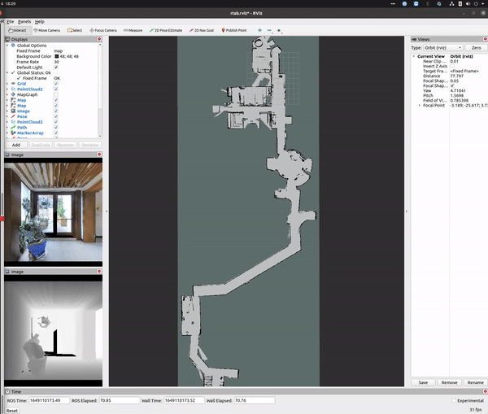
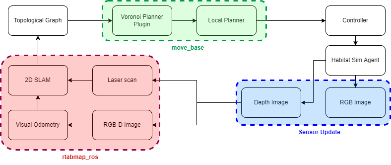

# spatial_interaction
This repository contains our work on developing an interactive mapping and planning pipeline for socially assistive robots. We use the photo-realistic Habitat-sim as the simulation environment for running this framework. Our framework consists of a mapping and a planning module, each of which are included here in two separate dockers. Our topological graph is build inside the mapping docker that resturns the voronoi paths between any two points in our enviuronments, which we call the global plan. The local planner then can then execute these plans. For an interactive system, we encode preferences of where the human is interested in going and then finally plan a tour of environment. The tour planner and the simulation environment are run together in the planning docker. In the given video that is sped up 4x, our tour planner returns the shortest path that is feasible within user constraints and turns them to the global and local planner, that then execute the plan. 

<br />

The framework used has the following components involved.

<center></center>

Our input sensors are RGB-D cameras only, we estimate odometry using a visual odometry pipeline in rtabmap_ros package. The system is amenable to be used with a range of different sensors that may be on board, 3D LiDAR, 2D Laser, IMU, etc. that will only improve the performance further. 

# Running our code 
We work on two separate docker environments and set the master as your host PC. For visualizations to work, we enable our docker to use the system GPU. To do so: Install docker-ce and then install the NVIDIA Container Toolkit using this link:
https://docs.nvidia.com/datacenter/cloud-native/container-toolkit/install-guide.html

# planning_sim_docker 

Get in the ``planning_sim_docker`` folder in the root of this repository. Build the docker using the following command:
```bash
cd planning_sim_docker
sudo docker build --tag sim .
```
Now you can run the code inside the docker, however we need to load the Matterport3D dataset inside the docker. We recommend you place the data in a folder called data inside the current directory where you launch the docker. 
To load the data in your container, make sure you have the Matterport data saved in the cloned repository. You can download the data from habitat_lab repository https://github.com/facebookresearch/habitat-lab or use the snippet of data in "GET LINK". If you save the path outside of thr current repository of the shell script, make sure to change the path to the data on your machine to be loaded correctly in your docker container. Finally, Run the bash file as follows:
```bash
./launch_docker.sh
```

Inside your docker container, you will find that all the associated code in the right path.
  
  Namely we have one main repositories in our docker path:
  
  1. habitat_ros_interface: Runs the habitat-sim simulation in a ros package using the map from rtabmap_ros, move_base for navigation. 

  Moreover there are 2 conda environments in your docker environment. 
  1. habitat - Based in python3.8 and runs all the files related to habitat_sim and habitat_lab
  2. robostackenv - Based in python3.9 and runs everything in ros noetic
 
  Once you're in your docker continue to run the following statements 
  
  ```bash
    . activate robostackenv
    cd /home/catkin_ws
    catkin_make
    source /home/catkin_ws/devel/setup.bash
    roslaunch habitat_interface default.launch
  ```
  
  This should have set up your ros interface with habitat. Now lets start our simulator threads.
  In another terminal inside your docker (docker exec -it <container_id> /bin/bash), run the following:
  
  ```bash
    . activate habitat
    cd /home/catkin_ws/src/habitat_ros_interface
    python scripts/using_teleport.py
  ```

# mapping_docker

Next is the mapper, that can build a topological graph given a 2D map, that we obtain from rtabmap_ros.
Finally, run these commands to build an image:

```bash
cd mapping_docker
sudo docker build --tag mapper .
```

Run the bash file as follows:

```bash
sudo chmod +x vulcan_image.sh
sudo ./vulcan_image.sh
```
Inside the docker run the following commands:

```bash 
cd ~/catkin_ws
catkin_make
roslaunch ros2lcm navigate.launch 
```
You can run the launch file navigate.launch in the ros2lcm package to start mapping and then save the resultant database file, called rtabmap.db by default from /root/.ros folder and save it for use in localization mode only.

In another terminal inside your docker (docker exec -it <container_id> /bin/bash), launch move_base planners, where the global planner is using our plugin that can return voronoi paths from our pre-built topological map. Launch the move_base server as: ``` roslaunch ros2lcm move_base_habitat.launch ```. 


Finally if you Rviz with the config file in the mapper docker, you should be able to see your robot in the habitat_sim navigation environment. Make sure that robot is well localized and the map is visible before running your tour planner. To start the tour planner, "Publish Point" anywhere in the map. This will show the calculated path for the robots, and also execute them. 

If this code was useful for you consider citing our paper: [[arXiv]](https://arxiv.org/abs/2206.10767)
```
@INPROCEEDINGS{9900525,
  author={Kathuria, Tribhi and Xu, Yifan and Chakhachiro, Theodor and Yang, X. Jessie and Ghaffari, Maani},
  booktitle={2022 31st IEEE International Conference on Robot and Human Interactive Communication (RO-MAN)}, 
  title={Providers-Clients-Robots: Framework for spatial-semantic planning for shared understanding in human-robot interaction}, 
  year={2022},
  pages={1099-1106},
  doi={10.1109/RO-MAN53752.2022.9900525}}
```
